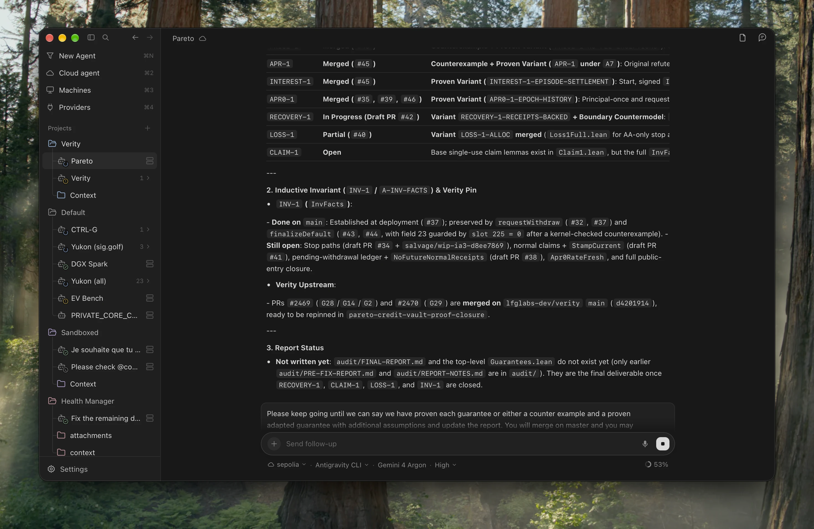
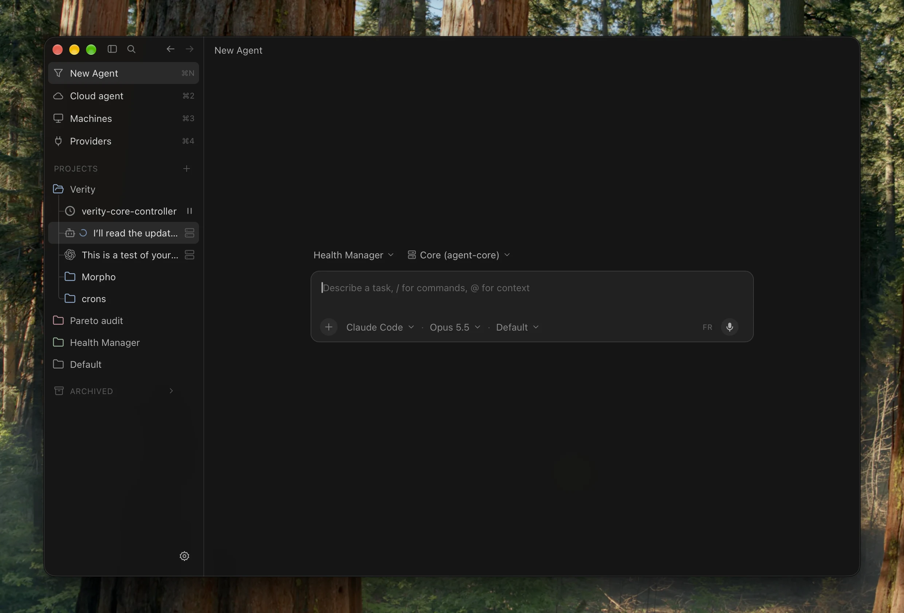
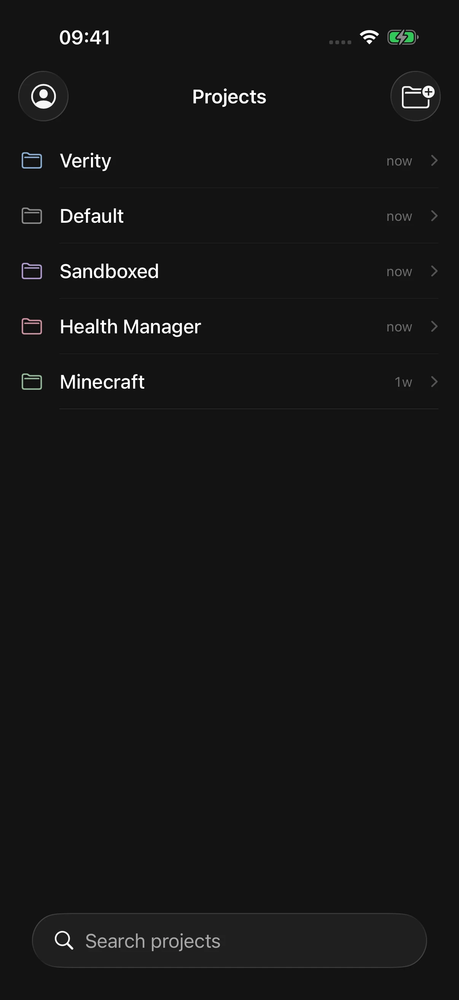
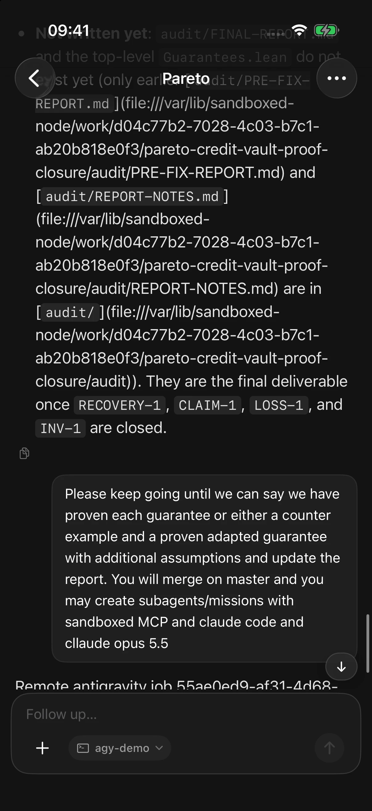

  

<h1 align="center">sandboxed.sh + Orb</h1>

  <strong>Your agents, machines and subscriptions. One place to work.</strong> 
  Use Orb on desktop or iOS to organize projects, launch agents and continue their conversations.

  <a href="#get-started">Get started</a> ·
  <a href="orb/README.md">Desktop</a> ·
  <a href="ios_dashboard/README.md">iOS</a> ·
  <a href="https://sandboxed.sh">Website</a> ·
  <a href="https://relens.ai/community">Discord</a>

## Choose where your agent works

| Mode | Where it runs | How you use it |
| --- | --- | --- |
| **Your computer** | A local coding agent on your desktop | Choose **New Agent → This computer**, then a harness and model. Work with your local files and tools. |
| **Your private cloud** | Your own servers and remote machines | Add machines to sandboxed.sh, then select one in Orb. Run agents in the configured host or isolated container workspace. |
| **Cloud agents** | A coordinator or provider-managed assistant | Choose **Cloud agent**, then Hermes, ChatGPT, Grok Bot or Cursor Cloud. Continue durable or provider conversations from Orb. |

Use **Claude Code**, **Codex**, **Antigravity**, **OpenCode** or **Grok** for
local and remote work, with live model, effort and cyber-access controls where
supported. Cloud agents have their own connections: **Hermes** binds to durable
coordinator conversations and router chains; **ChatGPT** uses a signed-in
browser profile and your available subscription modes; **Grok Bot** uses its
connected account; **Cursor Cloud** uses its official API with a repository,
Git reference and model.

## Pick up the conversation anywhere

Projects organize missions, per-project colors, skills and a synced local
**Context** folder in Finder. Inside a conversation:

- **Follow and steer live runs**: collapsible `Worked — …` tool/thought folds,
  nested subagents and callback reviews, inline prompt editing, and a
  Cursor-style follow-up queue that sends on turn completion or immediately.
- **Ask on the side**: open the docked `/btw` side-agent panel (`⌘⇧J`) to ask
  questions with shared workspace context without interrupting the main turn.
- **Keep long work moving**: schedule durable mission wake-ups, automatically
  resume interrupted runs after restarts, and transfer workspaces across
  machines (preserving symlinks while skipping build artifacts).
- **Rich output**: Markdown, code, tables, LaTeX, quizzes, inline images and
  clickable file links stay readable inside the transcript.

Orb for **iOS** connects to the same sandboxed.sh server: browse projects with
synced colors, inspect mission transcripts and activity folds, send follow-ups,
view or edit shared Markdown context, and manage backend, machines (with a
shared SSH address book) and providers.

  
  &nbsp;&nbsp;&nbsp;
   
  iOS Simulator · Connected to production (`Projects` list and `Verity / Pareto` mission).

## Bring your subscriptions

Sign in to supported subscription accounts directly from **Providers** in Orb
(macOS, web and iOS) or connect them through **CLIProxyAPI Plus**. You can
authenticate via OAuth, renew tokens, enable or disable individual accounts,
and inspect live plan/quota status; the proxy handles routing and rotation
across eligible accounts while Orb lets you choose the harness and model.

- [CLIProxyAPI Plus — maintained CCS fork](https://github.com/kaitranntt/CLIProxyAPIPlus)
- [CLIProxyAPI — upstream](https://github.com/router-for-me/CLIProxyAPI)
- [Credential ownership and proxy configuration](docs/CREDENTIAL_OWNERSHIP.md)

This routes **model inference** for coding agents. Managed cloud agents use
separate service adapters; connecting a proxy account does not sign in to the
ChatGPT browser or create a Cursor Cloud API account.

## Get started

1. **Run sandboxed.sh.** Follow the [Docker guide](docs/install-docker.md) or
   [native Linux guide](docs/install-native.md). It keeps the project record,
   mission history and remote execution services.
2. **Open Orb.** Build the [desktop client](orb/README.md) or the
   [iOS app](ios_dashboard/README.md), then enter your server URL and sign in.
3. **Connect your execution environment.** Set up local harnesses, register
   [remote machines](docs/REMOTE_NODES.md), or connect a cloud-agent account.
   Configure inference providers for the models you want to use.
4. **Create a project and launch an agent.** Choose its execution mode, write
   your task, and keep its conversation and results together.

## Under the hood

**Orb is the client; sandboxed.sh is the execution and persistence layer.**
Desktop is built with Tauri and SolidJS; iOS uses SwiftUI. The Rust backend owns
projects, missions, event history and remote-node coordination. Cloud adapters
observe provider work independently of the client window.

The same control plane is available over MCP for coordinators such as
[Hermes](https://github.com/Th0rgal/hermes-agent). Automation uses the same project
and mission records as Orb.

[Execution architecture](AGENTS.md) ·
[Workspaces](docs/WORKSPACES.md) ·
[MCP and Hermes](docs/HERMES_ORCHESTRATION.md) ·
[Development and troubleshooting](DEBUGGING.md)

---

Formerly Open Agent.
